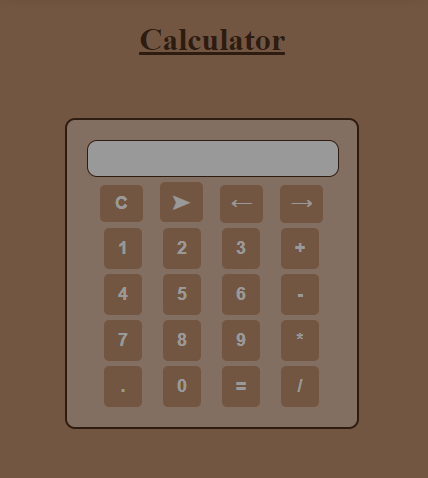

## Calculator Project

This project is a simple calculator application built using HTML5, CSS3, and JavaScript.

<a href="#" target="_blank">**Live Demo** 🚀</a>

### 📌 Tech Stack
&nbsp;
&nbsp;

### Features
- Basic arithmetic operations: addition, subtraction, multiplication, division, trigonometry.
- Responsive design.
- Simple and intuitive user interface.

### 🖼️ Sneak Peek

### 📬 Contact

If you have any questions or suggestions, feel free to reach out to me through the following channels:

- LinkedIn: [Imane Ougni](#)

© 2024 Imane Ougni
